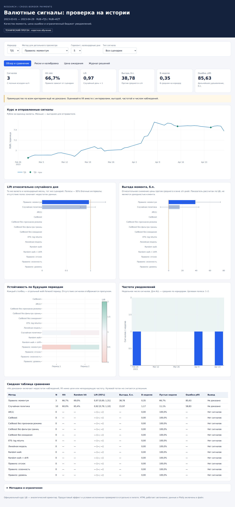

# Проверка реализации

Проверено 2026-09-05 на Python 3.12 с зависимостями из `uv.lock`.
Это проверка пайплайна, а не полноценная оценка качества обученной модели.

## Автоматические проверки

- `uv run pytest -q`: **24 passed**.
- `uv run ruff check src tests`: успешно.
- `uv run ruff format --check src tests`: успешно.
- Все восемь CSV побайтово совпадают с `m0/currency_data` из указанного в README коммита.

## Сквозной запуск на настоящих данных

```bash
uv run fx-signals run --config configs/smoke.yaml --out reports/smoke-final
```

Коридоры TJS/KZT, период оценки 2023-03-01 — 2023-04-29, два фолда,
15 итераций CatBoost, 11 методов и 3 абляции. Сформированы 1 204 строки решений,
22 отправки суммарно по независимым методам, отчёты и отдельный `final_model`.

Срез ALL, основной горизонт 5 календарных дней:

| Метод | Сигналы | Lift к случайному дню | Сигналов в неделю на коридор |
|---|---:|---:|---:|
| Правило моментума | 6 | 1.4068 | 0.35 |
| Случайная политика | 16 | 0.9731 | 0.9333 |
| Остальные методы, включая CatBoost | 0 | Не определён | 0 |

ML-политики на коротком участке не набрали минимального числа сигналов для
выбора порогов и отключили отправки. Эти результаты не подтверждают превосходство
ML. У правила моментума всего шесть наблюдений и частота ниже цели; одного lift
недостаточно для вывода. Проверка не меняет пороги ради ненулевого потока.

Дополнительно проверено точное совпадение результата `SignalEngine.signals()`
с сохранёнными решениями CatBoost на 2023-04-18, включая полезность и границы
риска. Отдельный финальный артефакт успешно загружен через тот же API.

## Дашборд

HTML открыт в Chromium без сервера. Проверены все четыре вкладки, переключение
метода/коридора, ALL, фильтр отправок, экспорт 16 строк случайной политики в CSV
и переключение на ширину 390 px. Ошибок JavaScript не обнаружено.



Полный эксперимент из `configs/default.yaml` намеренно не запускался: пользователь
обучает модели самостоятельно. HTML, модели и таблицы генерируются командами
из README и не включены в git; снимок экрана приведён только для ознакомления.
